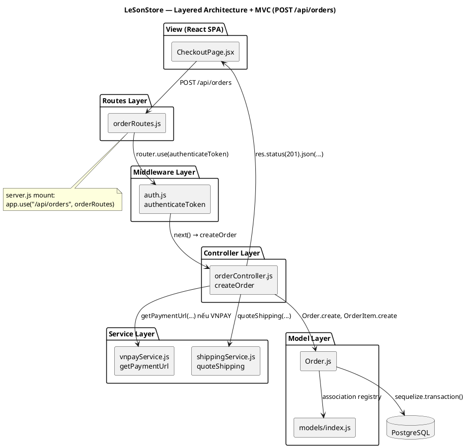
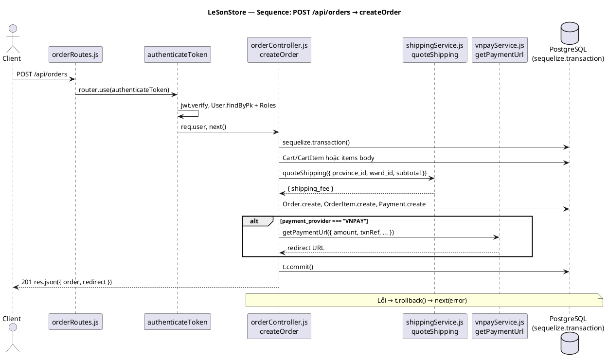
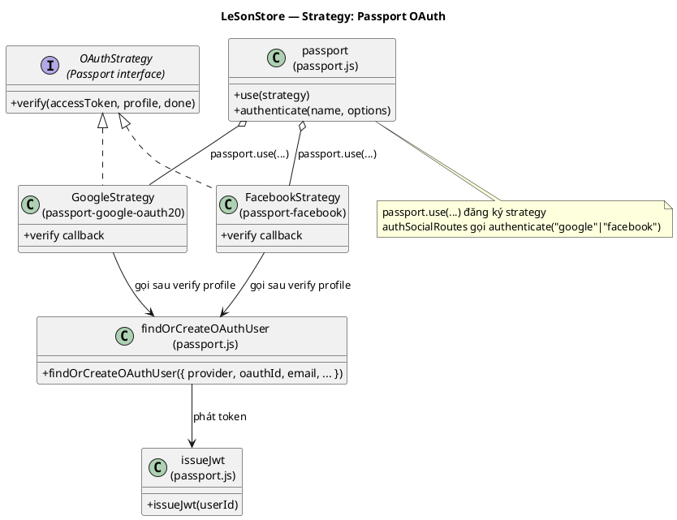
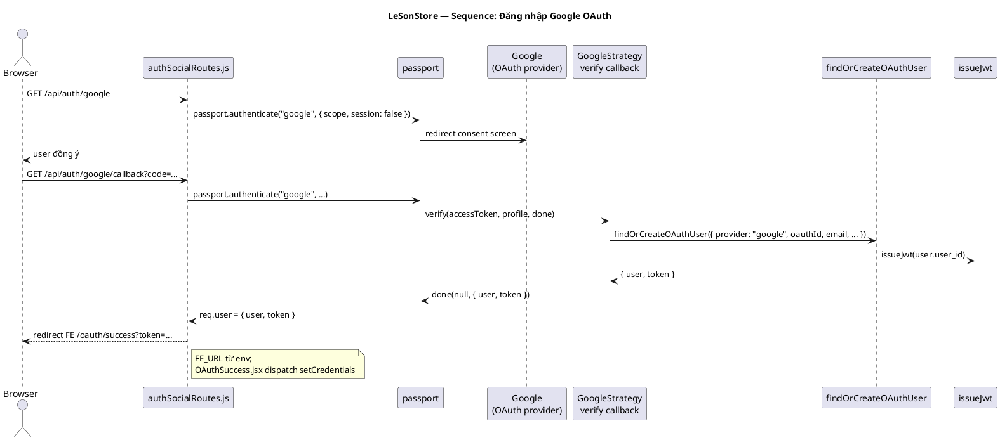
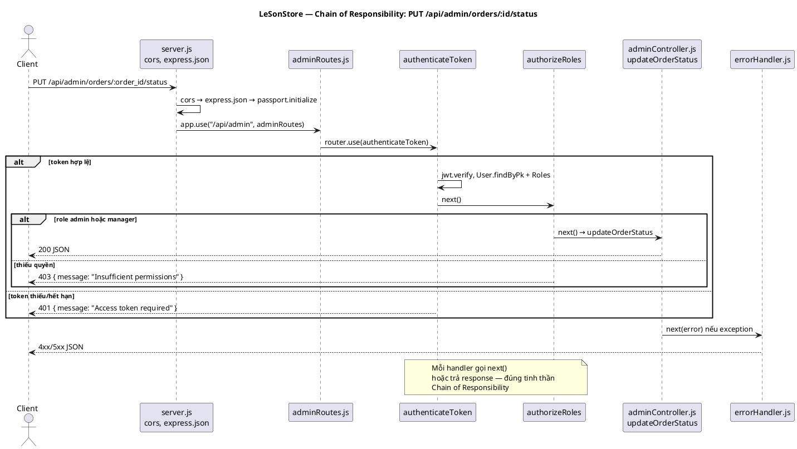
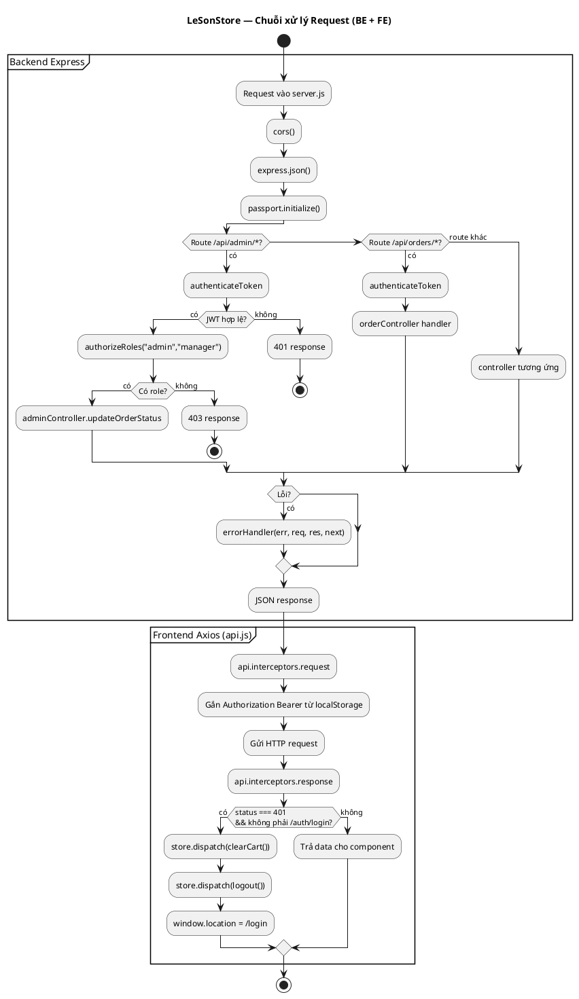
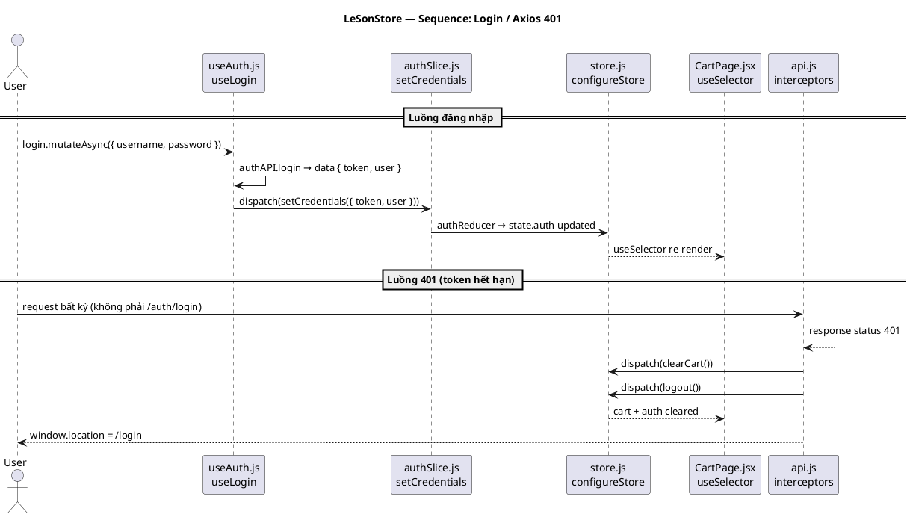
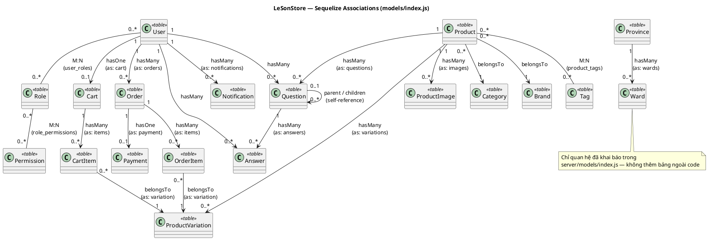

# Design Pattern — Bước 0: Pattern hiện hữu trong LeSonStore

**Ngày:** 05/06/2026  
**Ghi chú:** Bước 0 — pattern hiện hữu, không refactor

---

## Mục lục

1. [Pattern hiện hữu](#1-pattern-hiện-hữu)
2. [Layered Architecture + MVC](#2-layered-architecture--mvc)
3. [Strategy (Passport OAuth)](#3-strategy-passport-oauth)
4. [Chain of Responsibility (Middleware chain)](#4-chain-of-responsibility-middleware-chain)
5. [Flux / Redux (client)](#5-flux--redux-client)
6. [Sequelize associations (models/index.js)](#6-sequelize-associations-modelsindexjs)
7. [Tài liệu liên quan](#tài-liệu-liên-quan)

---

## 1. Pattern hiện hữu

LeSonStore là hệ thống thương mại điện tử laptop (monorepo `client/`, `server/`, `docs/`) được xây dựng theo mô hình Modular Monolith kết hợp microservice ML. Trong quá trình phát triển, dự án **đã áp dụng sẵn** nhiều design pattern thuộc nhóm GoF và kiến trúc phần mềm phổ biến mà **không cần refactor** để tồn tại — các pattern này nằm rải rác trong code và được tài liệu hóa tại đây nhằm phục vụ báo cáo đồ án.

Năm nhóm pattern được ghi nhận: **(1) Layered Architecture + MVC** — backend Express tổ chức theo tầng Routes → Middleware → Controller → Service → Model, frontend React đóng vai View; **(2) Strategy** — Passport đăng ký `GoogleStrategy` và `FacebookStrategy` cho OAuth; **(3) Chain of Responsibility** — chuỗi middleware Express (`authenticateToken`, `authorizeRoles`, `errorHandler`) và interceptor Axios trên client; **(4) Flux / Redux Toolkit** — luồng một chiều Action → Reducer → Store trên SPA; **(5) Sequelize Model Associations** — quan hệ ORM tập trung tại `server/models/index.js`.

Tài liệu này mô tả **hiện trạng (Bước 0)**: liệt kê pattern, vấn đề giải quyết, minh chứng file/hàm và sơ đồ PlantUML. Module **Orders** (`orderController.js`, ~1.600 dòng) sẽ được refactor có chủ đích ở bước sau (Facade, Repository, State machine…) — **chưa implement** trong repo hiện tại. Tài liệu **không** claim các pattern **Observer**, **Event Bus** hay **Facade** đã có trong codebase; các side-effect như gửi email hay thông báo hiện được gọi trực tiếp sau transaction, chưa qua bus sự kiện.

---

## 2. Layered Architecture + MVC

### A) Tên pattern và định nghĩa

**Layered Architecture (Kiến trúc phân lớp)** chia hệ thống thành các tầng có trách nhiệm riêng biệt. Mỗi tầng chỉ giao tiếp với tầng liền kề, giúp giảm coupling và dễ bảo trì theo domain.

**MVC (Model–View–Controller)** tách ba vai trò: Model quản lý dữ liệu, Controller điều phối request/response, View hiển thị cho người dùng. Trong LeSonStore, View là React SPA; Model là Sequelize; Controller là các file `*Controller.js`.

### B) Vấn đề giải quyết trong LeSonStore

LeSonStore có nhiều domain (catalog, cart, order, admin, payment). Cần tách routing HTTP khỏi logic nghiệp vụ và truy cập DB. Luồng đặt hàng `POST /api/orders` đi qua `orderRoutes` → `authenticateToken` → `orderController.createOrder`, gọi `quoteShipping`, `getPaymentUrl` rồi ghi `Order`/`OrderItem` qua Sequelize — minh họa rõ kiến trúc phân lớp kết hợp MVC.

### C) Minh chứng trong code

| File | Symbol | Vai trò |
|------|--------|---------|
| `server/server.js` | `app.use(cors())`, `app.use(express.json())` | Middleware toàn cục, parse body |
| `server/server.js` | `app.use("/api/orders", orderRoutes)` | Mount router theo domain |
| `server/server.js` | `app.use(errorHandler)` | Error handler cuối pipeline |
| `server/routes/orderRoutes.js` | `router.post("/", orderController.createOrder)` | Routes layer — ánh xạ HTTP → handler |
| `server/routes/orderRoutes.js` | `router.use(authenticateToken)` | Middleware cấp router |
| `server/controllers/orderController.js` | `exports.createOrder` | Controller — validate, transaction, orchestration |
| `server/services/vnpayService.js` | `exports.getPaymentUrl` | Service — tích hợp cổng VNPay |
| `server/services/shippingService.js` | `exports.quoteShipping` | Service — tính phí vận chuyển |
| `server/models/Order.js` | `Order` (Sequelize.define) | Model — schema bảng orders |
| `server/models/index.js` | `Order.hasMany(OrderItem)`, `module.exports` | Registry association + export model |

### D) Sơ đồ PlantUML

#### D.1 — Component diagram (5 tầng)



Export: PlantUML extension / plantuml.com → PNG cho báo cáo Word

#### D.2 — Sequence diagram (createOrder)



Export: PlantUML extension / plantuml.com → PNG cho báo cáo Word

---

## 3. Strategy (Passport OAuth)

### A) Tên pattern và định nghĩa

**Strategy** định nghĩa học các thuật toán có thể hoán đổi, đóng gói từng chiến lược trong class/object riêng. Client chọn strategy lúc runtime qua interface thống nhất.

Passport.js cung cấp interface `passport.authenticate(name)`. Mỗi nhà cung cấp OAuth (Google, Facebook) là một Strategy với callback verify riêng, dùng chung `findOrCreateOAuthUser` và `issueJwt`.

### B) Vấn đề giải quyết trong LeSonStore

Người dùng đăng nhập qua Google hoặc Facebook ngoài email/password. Mỗi provider có profile API và callback URL khác nhau. Strategy pattern gom logic chung (tìm/tạo user, gán role customer, tạo cart, phát JWT) vào `findOrCreateOAuthUser`, phần đặc thù nằm trong `GoogleStrategy` / `FacebookStrategy`.

### C) Minh chứng trong code

| File | Symbol | Vai trò |
|------|--------|---------|
| `server/config/passport.js` | `GoogleStrategy` | Strategy xác thực Google OAuth 2.0 |
| `server/config/passport.js` | `FacebookStrategy` | Strategy xác thực Facebook OAuth |
| `server/config/passport.js` | `findOrCreateOAuthUser` | Thuật toán dùng chung mọi provider |
| `server/config/passport.js` | `issueJwt` | Ký JWT 7 ngày sau OAuth thành công |
| `server/config/passport.js` | `passport.use(new GoogleStrategy(...))` | Đăng ký strategy vào Passport |
| `server/routes/authSocialRoutes.js` | `GET /google`, `GET /google/callback` | Route khởi tạo và callback Google |
| `server/routes/authSocialRoutes.js` | `GET /facebook`, `GET /facebook/callback` | Route khởi tạo và callback Facebook |
| `server/routes/authSocialRoutes.js` | `passport.authenticate("google", ...)` | Client chọn strategy theo tên |
| `server/server.js` | `app.use(passport.initialize())` | Khởi tạo Passport toàn cục |
| `server/server.js` | `app.use("/api/auth", authSocialRoutes)` | Mount social auth dưới `/api/auth` |

### D) Sơ đồ PlantUML

#### D.1 — Class diagram (Strategy)



Export: PlantUML extension / plantuml.com → PNG cho báo cáo Word

#### D.2 — Sequence diagram (đăng nhập Google)



Export: PlantUML extension / plantuml.com → PNG cho báo cáo Word

---

## 4. Chain of Responsibility (Middleware chain)

### A) Tên pattern và định nghĩa

**Chain of Responsibility** xử lý request qua chuỗi handler nối tiếp. Mỗi handler quyết định xử lý xong, gọi `next()` chuyển tiếp, hoặc dừng và trả response/lỗi.

Express triển khai pattern này qua `app.use()` và middleware `(req, res, next)`. Trên frontend, Axios interceptor trong `api.js` cũng tạo chuỗi xử lý request/response tương tự.

### B) Vấn đề giải quyết trong LeSonStore

Route admin (`PUT /api/admin/orders/:order_id/status`) yêu cầu JWT hợp lệ và role `admin` hoặc `manager`. Route order (`/api/orders/*`) yêu cầu đăng nhập. Tách concern bảo mật khỏi controller bằng `authenticateToken` → `authorizeRoles` → `adminController.updateOrderStatus`. Lỗi runtime được chuyển tới `errorHandler` cuối pipeline trong `server.js`.

### C) Minh chứng trong code

| File | Symbol | Vai trò |
|------|--------|---------|
| `server/middleware/auth.js` | `authenticateToken` | Verify JWT, gắn `req.user`, `req.userRoles` |
| `server/middleware/auth.js` | `authorizeRoles(...roles)` | Kiểm tra role (OR logic) |
| `server/routes/adminRoutes.js` | `router.use(authenticateToken)` | Auth cho toàn bộ `/api/admin/*` |
| `server/routes/adminRoutes.js` | `router.use(authorizeRoles("admin", "manager"))` | Phân quyền sau auth |
| `server/routes/adminRoutes.js` | `router.put("/orders/:order_id/status", adminController.updateOrderStatus)` | Handler cuối chuỗi admin |
| `server/routes/orderRoutes.js` | `router.use(authenticateToken)` | Mọi route order cần đăng nhập |
| `server/middleware/errorHandler.js` | `errorHandler` | Bắt lỗi Sequelize, JWT; trả JSON |
| `server/server.js` | `app.use(errorHandler)` | Mount sau tất cả routes |
| `client/app/services/api.js` | `api.interceptors.request.use(...)` | Gắn Bearer token trước mỗi request |
| `client/app/services/api.js` | `api.interceptors.response.use(...)` | 401 → `clearCart()` + `logout()` + redirect `/login` |

### D) Sơ đồ PlantUML

#### D.1 — Sequence diagram (PUT /api/admin/orders/:order_id/status)



Export: PlantUML extension / plantuml.com → PNG cho báo cáo Word

#### D.2 — Activity diagram (chuỗi middleware + Axios interceptor)



Export: PlantUML extension / plantuml.com → PNG cho báo cáo Word

> **Ghi chú:** Mỗi middleware/handler trong chuỗi hoặc gọi `next()` để chuyển tiếp, hoặc trả response trực tiếp (401/403) — đúng tinh thần Chain of Responsibility. Interceptor Axios trên client áp dụng cùng nguyên lý cho pipeline HTTP phía frontend.

---

## 5. Flux / Redux (client)

### A) Tên pattern và định nghĩa

**Flux** quản lý state theo luồng một chiều: View dispatch **Action** → **Reducer** cập nhật **Store** → View subscribe và re-render. **Redux Toolkit** (`createSlice`, `configureStore`) là implementation hiện đại của Flux, giảm boilerplate so với Redux thuần.

LeSonStore dùng Redux cho state chia sẻ: `auth`, `cart`, `ui`, `compare`. React Query xử lý server state; Redux giữ client state đồng bộ giữa các trang.

### B) Vấn đề giải quyết trong LeSonStore

Sau đăng nhập, token và user phải có ở Header, CartPage, CheckoutPage. `useLogin` dispatch `setCredentials`; CartPage đọc `useSelector(state => state.cart)`. Khi API trả 401, interceptor `api.js` dispatch `logout` và `clearCart` để đồng bộ UI.

### C) Minh chứng trong code

| File | Symbol | Vai trò |
|------|--------|---------|
| `client/app/store/store.js` | `configureStore` | Tạo store gộp 4 reducer |
| `client/app/store/store.js` | `reducer: { auth, cart, ui, compare }` | Root reducer map |
| `client/app/store/slices/authSlice.js` | `createSlice`, `setCredentials`, `logout` | State xác thực |
| `client/app/store/slices/cartSlice.js` | `createSlice`, `clearCart`, `setCartItems` | State giỏ hàng |
| `client/app/store/slices/compareSlice.js` | `createSlice`, `addCompare`, `clearCompare` | State so sánh sản phẩm |
| `client/app/store/slices/uiSlice.js` | `createSlice`, `toggleCartDrawer`, `addNotification` | State UI toàn cục |
| `client/app/hooks/useAuth.js` | `useLogin` → `dispatch(setCredentials(...))` | Luồng login → auth state |
| `client/app/pages/CartPage.jsx` | `useSelector((state) => state.cart)` | View đọc cart state |
| `client/app/main.jsx` | `<Provider store={store}>` | Inject store vào React tree |
| `client/app/services/api.js` | `store.dispatch(clearCart())`, `store.dispatch(logout())` | 401 → dọn Redux |

### D) Sơ đồ PlantUML

#### D.1 — Component diagram (Flux unidirectional)

```plantuml
@startuml redux_flux_component
title LeSonStore — Flux / Redux Toolkit (luồng một chiều)

skinparam componentStyle rectangle

package "View (React)" {
  [LoginPage.jsx\nuseLogin()] as Login
  [CartPage.jsx] as Cart
  [Header.jsx] as Header
}

package "Dispatch" {
  [dispatch(action)] as Dispatch
}

package "Reducer (createSlice)" {
  [authSlice\nauthReducer] as AuthR
  [cartSlice\ncartReducer] as CartR
  [uiSlice\nuiReducer] as UiR
  [compareSlice\ncompareReducer] as CompareR
}

package "Store" {
  [configureStore\nstore.js] as Store
}

Login --> Dispatch : dispatch(setCredentials)
Cart --> Dispatch : dispatch(setCartItems, ...)
Dispatch --> AuthR : setCredentials action
Dispatch --> CartR : clearCart action
AuthR --> Store : immutable update state.auth
CartR --> Store : immutable update state.cart
Store --> Header : useSelector(state.auth)
Store --> Cart : useSelector(state.cart)

note bottom of Store
  Redux Toolkit implement pattern Flux;
  không cần diagram riêng cho từng slice
  trừ khi báo cáo yêu cầu chi tiết
end note

@enduml
```

Export: PlantUML extension / plantuml.com → PNG cho báo cáo Word

#### D.2 — Sequence diagram (login và 401)



Export: PlantUML extension / plantuml.com → PNG cho báo cáo Word

> **Ghi chú:** Redux Toolkit (`createSlice`, `configureStore`) là implementation của pattern Flux trên client. Không cần vẽ diagram riêng cho từng slice (`authSlice`, `cartSlice`, `uiSlice`, `compareSlice`) trừ khi báo cáo yêu cầu chi tiết từng domain state.

---

## 6. Sequelize associations (models/index.js)

### A) Tên pattern và định nghĩa

**Model Association Registry** (ORM Sequelize) tập trung khai báo quan hệ giữa entity tại `server/models/index.js`. Mỗi file model định nghĩa schema; file index gọi `hasMany`, `belongsTo`, `belongsToMany` mô tả cardinality và bảng trung gian (junction table).

Pattern tạo **single entry point** export `{ sequelize, User, Order, ... }` cho controllers, tránh circular require giữa các model file.

### B) Vấn đề giải quyết trong LeSonStore

PostgreSQL có 18+ bảng với quan hệ phức tạp (User–Role N-N, Product–Tag N-N, Order–Payment 1-1, Question self-reference). Khai báo association một lần tại `index.js` cho phép `include` nested query trong controller (VD: `Order.findOne({ include: [{ model: OrderItem, as: "items" }] })`).

### C) Minh chứng trong code

| File | Symbol | Vai trò |
|------|--------|---------|
| `server/models/index.js` | `User.belongsToMany(Role, { through: "user_roles" })` | M:N phân quyền người dùng |
| `server/models/index.js` | `Role.belongsToMany(Permission, { through: "role_permissions" })` | M:N quyền theo role |
| `server/models/index.js` | `Product.belongsTo(Category)`, `Category.hasMany(Product)` | N:1 catalog — danh mục |
| `server/models/index.js` | `Product.belongsTo(Brand)`, `Brand.hasMany(Product)` | N:1 catalog — thương hiệu |
| `server/models/index.js` | `Product.belongsToMany(Tag, { through: "product_tags" })` | M:N product–tag |
| `server/models/index.js` | `Product.hasMany(ProductVariation, { as: "variations" })` | 1:N biến thể sản phẩm |
| `server/models/index.js` | `Product.hasMany(ProductImage, { as: "images" })` | 1:N ảnh sản phẩm |
| `server/models/index.js` | `User.hasOne(Cart)`, `Cart.hasMany(CartItem)` | 1:1 user–cart; 1:N cart items |
| `server/models/index.js` | `CartItem.belongsTo(ProductVariation, { as: "variation" })` | N:1 item → variation |
| `server/models/index.js` | `User.hasMany(Order)`, `Order.hasMany(OrderItem)` | 1:N user–order–items |
| `server/models/index.js` | `OrderItem.belongsTo(ProductVariation, { as: "variation" })` | N:1 order item → variation |
| `server/models/index.js` | `Order.hasOne(Payment, { as: "payment" })` | 1:1 order–payment |
| `server/models/index.js` | `Product.hasMany(Question)`, `Question.hasMany(Answer)` | 1:N Q&A trên sản phẩm |
| `server/models/index.js` | `Question.belongsTo(Question, { as: "parent" })` | Self-reference parent/children |
| `server/models/index.js` | `User.hasMany(Notification)` | 1:N thông báo người dùng |
| `server/models/index.js` | `Province.hasMany(Ward, { as: "wards" })` | 1:N địa lý VN |
| `server/models/index.js` | `module.exports = { sequelize, User, ... }` | Registry export |

### D) Sơ đồ PlantUML

#### D.1 — Class diagram (ER style)



Export: PlantUML extension / plantuml.com → PNG cho báo cáo Word

---

## Tài liệu liên quan

- [System Architecture — LeSonStore](../../docs/architecture/system-architecture.md)
- [Backend Convention](../../docs/engineering_rules/backend-convention.md)
- [Frontend Convention](../../docs/engineering_rules/frontend-convention.md)

---

*Tài liệu Bước 0 — mô tả pattern hiện hữu. Refactor module Orders (Facade, Repository, State, Payment Strategy): bước tiếp theo, chưa có trong repo.*
