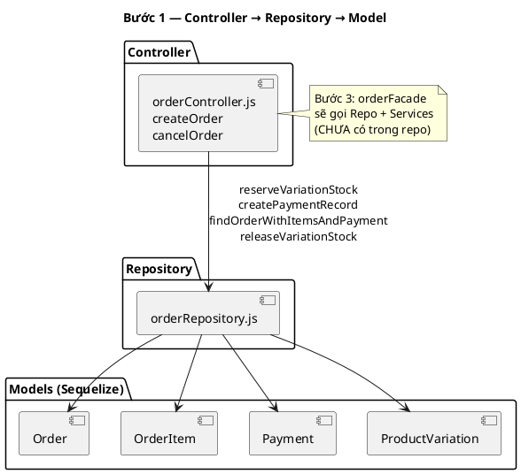

# Ghi chú báo cáo đồ án — Bước 1 Repository

---

## 1. Vì sao chọn Repository trước Facade?

`orderController.js` (~1.600 dòng) trộn **orchestration** (validate, tính tiền, email) với **data access** (lock row, `Payment.create`, `findOne` có `FOR UPDATE`). Repository tách lớp truy cập DB trước vì:

- Dễ chứng minh pattern trong báo cáo (vấn đề → giải pháp → file).
- Refactor **an toàn**: test `createOrder` / `cancelOrder` (30 case) pass mà không đổi route hay contract JSON.
- Là nền cho **Facade (Bước 3)** — Facade gọi repository, không thay thế repository.

## 2. Pattern áp dụng

| Khái niệm | Áp dụng trong LeSonStore |
|-----------|--------------------------|
| **Repository** | `orderRepository.js` — abstraction trên Sequelize |
| **Single Responsibility** | Controller: HTTP + orchestration; Repository: persistence |
| **Dependency direction** | Controller → Repository → Models |

**Không claim:** Facade, Strategy (payment), State (order status), Observer/Event Bus — các bước sau hoặc chưa có.

## 3. Câu mô tả cho báo cáo (copy-paste gợi ý)

> Module Orders ban đầu thực hiện khóa tồn kho (`SELECT … FOR UPDATE`), tạo bản ghi thanh toán và truy vấn đơn hàng trực tiếp trong `orderController`. Bước refactor 1 giới thiệu lớp `orderRepository` gồm bốn phương thức: `reserveVariationStock`, `createPaymentRecord`, `findOrderWithItemsAndPayment`, `releaseVariationStock`. Hai use case `createOrder` và `cancelOrder` chuyển sang gọi repository trong cùng transaction Sequelize, giữ nguyên mã HTTP và thông báo lỗi. Kiểm thử hồi quy 30 test case xác nhận không regression.

## 4. Sơ đồ class diagram

File nguồn: [diagrams/repository-class.puml](./diagrams/repository-class.puml)

Export: PlantUML extension / [plantuml.com](https://www.plantuml.com/plantuml) → PNG cho báo cáo Word.

Sơ đồ gợi ý (rút gọn — bản đầy đủ trong file `.puml`):



## 5. Lộ trình refactor (tham chiếu)

| Bước | Nội dung | Trạng thái |
|------|----------|------------|
| 0 | Ghi nhận pattern hiện hữu | ✅ `reports/already_done/` |
| **1** | **Repository** | ✅ Bước này |
| 2 | (Tuỳ kế hoạch) Payment Strategy / State | Chưa làm |
| **3** | **Facade** — orchestration `createOrder` | Chưa làm |

## 6. Minh chứng test

```
npm test -- __tests__/orders/createOrder.test.js __tests__/orders/cancelOrder.test.js
→ 2 suites, 30 tests passed
```

Không sửa file test — chứng minh refactor không đổi hành vi observable.

## 7. Liên kết tài liệu

- [Bước 0 — Pattern hiện hữu](../../already_done/design-patterns-step0.md)
- [README bước 1](./README.md)
- [API repository](./repository-api.md)
